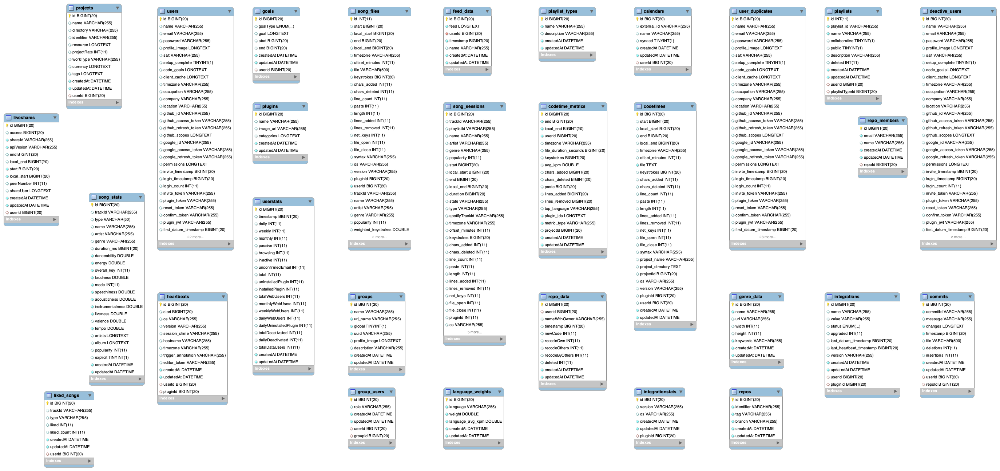

# Database


## Generate Schema Diagram

Generated with **SQL Workbench Community Edition** [Download](https://dev.mysql.com/downloads/workbench/) and install.



-   Open SQL Workbench

-   Connect to the db

-   `Database > Reverse Engineer... Ctl+R`

-   `File > Export as PNG...`

-   `File > Export > Forward Engineer SQL Create Script`

#### ⚠️ Warnings may be ignored.

## Generated Script

```sql
-- MySQL Script generated by MySQL Workbench
-- Tue Sep  3 21:16:20 2019
-- Model: New Model    Version: 1.0
-- MySQL Workbench Forward Engineering

SET @OLD_UNIQUE_CHECKS=@@UNIQUE_CHECKS, UNIQUE_CHECKS=0;
SET @OLD_FOREIGN_KEY_CHECKS=@@FOREIGN_KEY_CHECKS, FOREIGN_KEY_CHECKS=0;
SET @OLD_SQL_MODE=@@SQL_MODE, SQL_MODE='ONLY_FULL_GROUP_BY,STRICT_TRANS_TABLES,NO_ZERO_IN_DATE,NO_ZERO_DATE,ERROR_FOR_DIVISION_BY_ZERO,NO_ENGINE_SUBSTITUTION';

-- -----------------------------------------------------
-- Schema mydb
-- -----------------------------------------------------
SHOW WARNINGS;
-- -----------------------------------------------------
-- Schema sftw
-- -----------------------------------------------------
DROP SCHEMA IF EXISTS `sftw` ;

-- -----------------------------------------------------
-- Schema sftw
-- -----------------------------------------------------
CREATE SCHEMA IF NOT EXISTS `sftw` DEFAULT CHARACTER SET latin1 ;
SHOW WARNINGS;
USE `sftw` ;

-- -----------------------------------------------------
-- Table `sftw`.`calendars`
-- -----------------------------------------------------
DROP TABLE IF EXISTS `sftw`.`calendars` ;

SHOW WARNINGS;
CREATE TABLE IF NOT EXISTS `sftw`.`calendars` (
  `id` BIGINT(20) NOT NULL AUTO_INCREMENT,
  `external_id` VARCHAR(255) NULL DEFAULT NULL,
  `name` VARCHAR(255) NULL DEFAULT NULL,
  `synced` TINYINT(1) NULL DEFAULT NULL,
  `createdAt` DATETIME NOT NULL,
  `updatedAt` DATETIME NOT NULL,
  `userId` BIGINT(20) NULL DEFAULT NULL,
  PRIMARY KEY (`id`),
  CONSTRAINT `calendars_ibfk_1`
    FOREIGN KEY (`userId`)
    REFERENCES `sftw`.`users` (`id`)
    ON DELETE SET NULL
    ON UPDATE CASCADE)
ENGINE = InnoDB
AUTO_INCREMENT = 6
DEFAULT CHARACTER SET = latin1;

SHOW WARNINGS;
CREATE INDEX `userId` ON `sftw`.`calendars` (`userId` ASC) VISIBLE;

SHOW WARNINGS;

-- -----------------------------------------------------
-- Table `sftw`.`codetime_metrics`
-- -----------------------------------------------------
DROP TABLE IF EXISTS `sftw`.`codetime_metrics` ;

SHOW WARNINGS;
CREATE TABLE IF NOT EXISTS `sftw`.`codetime_metrics` (
  `id` BIGINT(20) NOT NULL AUTO_INCREMENT,
  `end` BIGINT(20) NOT NULL,
  `local_end` BIGINT(20) NOT NULL,
  `userId` BIGINT(20) NOT NULL,
  `timezone` VARCHAR(255) NULL DEFAULT NULL,
  `file_duration_seconds` BIGINT(20) NULL DEFAULT NULL,
  `keystrokes` BIGINT(20) NULL DEFAULT NULL,
  `avg_kpm` DOUBLE NULL DEFAULT NULL,
  `chars_added` BIGINT(20) NULL DEFAULT NULL,
  `chars_deleted` BIGINT(20) NULL DEFAULT NULL,
  `paste` BIGINT(20) NULL DEFAULT NULL,
  `lines_added` BIGINT(20) NULL DEFAULT NULL,
  `lines_removed` BIGINT(20) NULL DEFAULT NULL,
  `top_language` VARCHAR(255) NULL DEFAULT NULL,
  `plugin_ids` LONGTEXT CHARACTER SET 'utf8mb4' COLLATE 'utf8mb4_bin' NOT NULL,
  `metric_type` VARCHAR(255) NOT NULL,
  `projectId` BIGINT(20) NULL DEFAULT NULL,
  `createdAt` DATETIME NOT NULL,
  `updatedAt` DATETIME NOT NULL,
  PRIMARY KEY (`id`))
ENGINE = InnoDB
AUTO_INCREMENT = 4
DEFAULT CHARACTER SET = latin1;

SHOW WARNINGS;
CREATE UNIQUE INDEX `codetime_metrics_userId_end_projectId_idx` ON `sftw`.`codetime_metrics` (`userId` ASC, `end` ASC, `projectId` ASC) VISIBLE;

SHOW WARNINGS;
CREATE INDEX `codetime_metrics_userId_end_localEnd_projectId_idx` ON `sftw`.`codetime_metrics` (`userId` ASC, `end` ASC, `local_end` ASC, `projectId` ASC) VISIBLE;

SHOW WARNINGS;

-- -----------------------------------------------------
-- Table `sftw`.`codetimes`
-- -----------------------------------------------------
DROP TABLE IF EXISTS `sftw`.`codetimes` ;

SHOW WARNINGS;
CREATE TABLE IF NOT EXISTS `sftw`.`codetimes` (
  `id` BIGINT(20) NOT NULL AUTO_INCREMENT,
  `start` BIGINT(20) NULL DEFAULT NULL,
  `local_start` BIGINT(20) NULL DEFAULT NULL,
  `end` BIGINT(20) NULL DEFAULT NULL,
  `local_end` BIGINT(20) NULL DEFAULT NULL,
  `timezone` VARCHAR(255) NULL DEFAULT NULL,
  `offset_minutes` INT(11) NULL DEFAULT NULL,
  `file` TEXT NOT NULL,
  `keystrokes` BIGINT(20) NULL DEFAULT NULL,
  `chars_added` INT(11) NULL DEFAULT NULL,
  `chars_deleted` INT(11) NULL DEFAULT NULL,
  `line_count` INT(11) NULL DEFAULT NULL,
  `paste` INT(11) NULL DEFAULT NULL,
  `length` INT(11) NULL DEFAULT NULL,
  `lines_added` INT(11) NULL DEFAULT NULL,
  `lines_removed` INT(11) NULL DEFAULT NULL,
  `net_keys` INT(11) NULL DEFAULT NULL,
  `file_open` INT(11) NULL DEFAULT NULL,
  `file_close` INT(11) NULL DEFAULT NULL,
  `syntax` VARCHAR(255) NULL DEFAULT NULL,
  `project_name` VARCHAR(255) NULL DEFAULT NULL,
  `project_directory` TEXT NULL DEFAULT NULL,
  `projectId` BIGINT(20) NULL DEFAULT NULL,
  `os` VARCHAR(255) NULL DEFAULT NULL,
  `version` VARCHAR(255) NULL DEFAULT NULL,
  `pluginId` BIGINT(20) NULL DEFAULT NULL,
  `userId` BIGINT(20) NULL DEFAULT NULL,
  `createdAt` DATETIME NOT NULL,
  `updatedAt` DATETIME NOT NULL,
  PRIMARY KEY (`id`))
ENGINE = InnoDB
AUTO_INCREMENT = 40850
DEFAULT CHARACTER SET = latin1;

SHOW WARNINGS;
CREATE UNIQUE INDEX `codetimes_start_file_pluginId_userId_idx` ON `sftw`.`codetimes` (`start` ASC, `file`(500) ASC, `pluginId` ASC, `userId` ASC) VISIBLE;

SHOW WARNINGS;
CREATE INDEX `codetimes_start_idx` ON `sftw`.`codetimes` (`start` ASC) VISIBLE;

SHOW WARNINGS;
CREATE INDEX `codetimes_localStart_idx` ON `sftw`.`codetimes` (`local_start` ASC) VISIBLE;

SHOW WARNINGS;
CREATE INDEX `codetimes_userId_start_idx` ON `sftw`.`codetimes` (`userId` ASC, `start` ASC) VISIBLE;

SHOW WARNINGS;
CREATE INDEX `codetimes_lower_syntax_idx` ON `sftw`.`codetimes` (`syntax` ASC) VISIBLE;

SHOW WARNINGS;
CREATE FULLTEXT INDEX `codetimes_files_ft_idx` ON `sftw`.`codetimes` (`file`) VISIBLE;

SHOW WARNINGS;

-- -----------------------------------------------------
-- Table `sftw`.`commits`
-- -----------------------------------------------------
DROP TABLE IF EXISTS `sftw`.`commits` ;

SHOW WARNINGS;
CREATE TABLE IF NOT EXISTS `sftw`.`commits` (
  `id` BIGINT(20) NOT NULL AUTO_INCREMENT,
  `commitId` VARCHAR(255) NOT NULL,
  `message` VARCHAR(255) NULL DEFAULT NULL,
  `changes` LONGTEXT CHARACTER SET 'utf8mb4' COLLATE 'utf8mb4_bin' NOT NULL,
  `timestamp` BIGINT(20) NOT NULL,
  `file` VARCHAR(500) NULL DEFAULT NULL,
  `deletions` INT(11) NULL DEFAULT NULL,
  `insertions` INT(11) NULL DEFAULT NULL,
  `createdAt` DATETIME NOT NULL,
  `updatedAt` DATETIME NOT NULL,
  `userId` BIGINT(20) NULL DEFAULT NULL,
  `repoId` BIGINT(20) NULL DEFAULT NULL,
  PRIMARY KEY (`id`),
  CONSTRAINT `commits_ibfk_1`
    FOREIGN KEY (`userId`)
    REFERENCES `sftw`.`users` (`id`)
    ON DELETE SET NULL
    ON UPDATE CASCADE,
  CONSTRAINT `commits_ibfk_2`
    FOREIGN KEY (`repoId`)
    REFERENCES `sftw`.`repos` (`id`)
    ON DELETE SET NULL
    ON UPDATE CASCADE)
ENGINE = InnoDB
DEFAULT CHARACTER SET = latin1;

SHOW WARNINGS;
CREATE UNIQUE INDEX `commits_timestamp_commitId_idx` ON `sftw`.`commits` (`timestamp` ASC, `commitId` ASC) VISIBLE;

SHOW WARNINGS;
CREATE INDEX `repoId` ON `sftw`.`commits` (`repoId` ASC) VISIBLE;

SHOW WARNINGS;
CREATE INDEX `commits_userId_id_idx` ON `sftw`.`commits` (`userId` ASC, `id` ASC) VISIBLE;

SHOW WARNINGS;

-- -----------------------------------------------------
-- Table `sftw`.`deactive_users`
-- -----------------------------------------------------
DROP TABLE IF EXISTS `sftw`.`deactive_users` ;

SHOW WARNINGS;
CREATE TABLE IF NOT EXISTS `sftw`.`deactive_users` (
  `id` BIGINT(20) NOT NULL,
  `name` VARCHAR(255) NULL DEFAULT NULL,
  `email` VARCHAR(255) NULL DEFAULT NULL,
  `password` VARCHAR(255) NULL DEFAULT NULL,
  `profile_image` LONGTEXT NULL DEFAULT NULL,
  `salt` VARCHAR(255) NULL DEFAULT NULL,
  `setup_complete` TINYINT(1) NULL DEFAULT NULL,
  `code_goals` LONGTEXT CHARACTER SET 'utf8mb4' COLLATE 'utf8mb4_bin' NULL DEFAULT NULL,
  `client_cache` LONGTEXT CHARACTER SET 'utf8mb4' COLLATE 'utf8mb4_bin' NULL DEFAULT NULL,
  `timezone` VARCHAR(255) NULL DEFAULT NULL,
  `occupation` VARCHAR(255) NULL DEFAULT NULL,
  `company` VARCHAR(255) NULL DEFAULT NULL,
  `location` VARCHAR(255) NULL DEFAULT NULL,
  `github_id` VARCHAR(255) NULL DEFAULT NULL,
  `github_access_token` VARCHAR(255) NULL DEFAULT NULL,
  `github_refresh_token` VARCHAR(255) NULL DEFAULT NULL,
  `github_scopes` LONGTEXT CHARACTER SET 'utf8mb4' COLLATE 'utf8mb4_bin' NULL DEFAULT NULL,
  `google_id` VARCHAR(255) NULL DEFAULT NULL,
  `google_access_token` VARCHAR(255) NULL DEFAULT NULL,
  `google_refresh_token` VARCHAR(255) NULL DEFAULT NULL,
  `permissions` LONGTEXT CHARACTER SET 'utf8mb4' COLLATE 'utf8mb4_bin' NULL DEFAULT NULL,
  `invite_timestamp` BIGINT(20) NULL DEFAULT NULL,
  `login_timestamp` BIGINT(20) NULL DEFAULT 0,
  `login_count` INT(11) NULL DEFAULT 0,
  `invite_token` VARCHAR(255) NULL DEFAULT NULL,
  `plugin_token` VARCHAR(255) NULL DEFAULT NULL,
  `reset_token` VARCHAR(255) NULL DEFAULT NULL,
  `confirm_token` VARCHAR(255) NULL DEFAULT NULL,
  `plugin_jwt` VARCHAR(255) NULL DEFAULT NULL,
  `first_datum_timestamp` BIGINT(20) NULL DEFAULT 0,
  `last_datum_timestamp` BIGINT(20) NULL DEFAULT 0,
  `time_to_collect_data` BIGINT(20) NULL DEFAULT NULL,
  `oauths` LONGTEXT CHARACTER SET 'utf8mb4' COLLATE 'utf8mb4_bin' NULL DEFAULT NULL,
  `preferences` LONGTEXT CHARACTER SET 'utf8mb4' COLLATE 'utf8mb4_bin' NULL DEFAULT NULL,
  `datum_count` BIGINT(20) NULL DEFAULT 0,
  `groups` LONGTEXT CHARACTER SET 'utf8mb4' COLLATE 'utf8mb4_bin' NULL DEFAULT NULL,
  `createdAt` DATETIME NOT NULL,
  `updatedAt` DATETIME NOT NULL,
  PRIMARY KEY (`id`))
ENGINE = InnoDB
DEFAULT CHARACTER SET = latin1;

SHOW WARNINGS;
CREATE UNIQUE INDEX `email` ON `sftw`.`deactive_users` (`email` ASC) VISIBLE;

SHOW WARNINGS;
CREATE UNIQUE INDEX `github_id` ON `sftw`.`deactive_users` (`github_id` ASC) VISIBLE;

SHOW WARNINGS;
CREATE UNIQUE INDEX `google_id` ON `sftw`.`deactive_users` (`google_id` ASC) VISIBLE;

SHOW WARNINGS;
CREATE UNIQUE INDEX `invite_token` ON `sftw`.`deactive_users` (`invite_token` ASC) VISIBLE;

SHOW WARNINGS;
CREATE UNIQUE INDEX `plugin_token` ON `sftw`.`deactive_users` (`plugin_token` ASC) VISIBLE;

SHOW WARNINGS;
CREATE UNIQUE INDEX `reset_token` ON `sftw`.`deactive_users` (`reset_token` ASC) VISIBLE;

SHOW WARNINGS;
CREATE UNIQUE INDEX `confirm_token` ON `sftw`.`deactive_users` (`confirm_token` ASC) VISIBLE;

SHOW WARNINGS;
CREATE UNIQUE INDEX `deactive_users_confirmToken_idx` ON `sftw`.`deactive_users` (`confirm_token` ASC) VISIBLE;

SHOW WARNINGS;
CREATE UNIQUE INDEX `deactive_users_email_idx` ON `sftw`.`deactive_users` (`email` ASC) VISIBLE;

SHOW WARNINGS;
CREATE UNIQUE INDEX `deactive_users_githubId_idx` ON `sftw`.`deactive_users` (`github_id` ASC) VISIBLE;

SHOW WARNINGS;
CREATE UNIQUE INDEX `deactive_users_googleId_idx` ON `sftw`.`deactive_users` (`google_id` ASC) VISIBLE;

SHOW WARNINGS;
CREATE UNIQUE INDEX `deactive_users_invite_token_idx` ON `sftw`.`deactive_users` (`invite_token` ASC) VISIBLE;

SHOW WARNINGS;
CREATE UNIQUE INDEX `deactive_users_reset_token_idx` ON `sftw`.`deactive_users` (`reset_token` ASC) VISIBLE;

SHOW WARNINGS;

-- -----------------------------------------------------
-- Table `sftw`.`feed_data`
-- -----------------------------------------------------
DROP TABLE IF EXISTS `sftw`.`feed_data` ;

SHOW WARNINGS;
CREATE TABLE IF NOT EXISTS `sftw`.`feed_data` (
  `id` BIGINT(20) NOT NULL AUTO_INCREMENT,
  `feed` LONGTEXT CHARACTER SET 'utf8mb4' COLLATE 'utf8mb4_bin' NOT NULL,
  `userId` BIGINT(20) NOT NULL,
  `timestamp` BIGINT(20) NOT NULL,
  `name` VARCHAR(255) NULL DEFAULT NULL,
  `createdAt` DATETIME NOT NULL,
  `updatedAt` DATETIME NOT NULL,
  PRIMARY KEY (`id`),
  CONSTRAINT `feed_data_ibfk_1`
    FOREIGN KEY (`userId`)
    REFERENCES `sftw`.`users` (`id`)
    ON DELETE NO ACTION
    ON UPDATE CASCADE)
ENGINE = InnoDB
AUTO_INCREMENT = 292
DEFAULT CHARACTER SET = latin1;

SHOW WARNINGS;
CREATE UNIQUE INDEX `feed_data_timestamp_userId_name_idx` ON `sftw`.`feed_data` (`timestamp` ASC, `userId` ASC, `name` ASC) VISIBLE;

SHOW WARNINGS;
CREATE INDEX `feed_data_userId_id_idx` ON `sftw`.`feed_data` (`userId` ASC, `id` ASC) VISIBLE;

SHOW WARNINGS;
CREATE INDEX `feed_data_userId_timestamp_idx` ON `sftw`.`feed_data` (`userId` ASC, `timestamp` ASC) VISIBLE;

SHOW WARNINGS;

-- -----------------------------------------------------
-- Table `sftw`.`genre_data`
-- -----------------------------------------------------
DROP TABLE IF EXISTS `sftw`.`genre_data` ;

SHOW WARNINGS;
CREATE TABLE IF NOT EXISTS `sftw`.`genre_data` (
  `id` BIGINT(20) NOT NULL,
  `name` VARCHAR(255) NOT NULL,
  `url` VARCHAR(255) NULL DEFAULT NULL,
  `width` INT(11) NULL DEFAULT NULL,
  `height` INT(11) NULL DEFAULT NULL,
  `keywords` VARCHAR(255) NOT NULL,
  `createdAt` DATETIME NOT NULL,
  `updatedAt` DATETIME NOT NULL,
  PRIMARY KEY (`id`))
ENGINE = InnoDB
DEFAULT CHARACTER SET = latin1;

SHOW WARNINGS;
CREATE FULLTEXT INDEX `genre_data_keywords_ft_idx` ON `sftw`.`genre_data` (`keywords`) VISIBLE;

SHOW WARNINGS;

-- -----------------------------------------------------
-- Table `sftw`.`goals`
-- -----------------------------------------------------
DROP TABLE IF EXISTS `sftw`.`goals` ;

SHOW WARNINGS;
CREATE TABLE IF NOT EXISTS `sftw`.`goals` (
  `id` BIGINT(20) NOT NULL AUTO_INCREMENT,
  `goalType` ENUM('CODE_START_TIME', 'DAILY_HOURS', 'SESSION_HOURS') NULL DEFAULT 'CODE_START_TIME',
  `goal` LONGTEXT CHARACTER SET 'utf8mb4' COLLATE 'utf8mb4_bin' NULL DEFAULT NULL,
  `start` BIGINT(20) NULL DEFAULT 1565150246,
  `end` BIGINT(20) NULL DEFAULT NULL,
  `createdAt` DATETIME NOT NULL,
  `updatedAt` DATETIME NOT NULL,
  `userId` BIGINT(20) NULL DEFAULT NULL,
  PRIMARY KEY (`id`),
  CONSTRAINT `goals_ibfk_1`
    FOREIGN KEY (`userId`)
    REFERENCES `sftw`.`users` (`id`)
    ON DELETE SET NULL
    ON UPDATE CASCADE)
ENGINE = InnoDB
AUTO_INCREMENT = 11
DEFAULT CHARACTER SET = latin1;

SHOW WARNINGS;
CREATE INDEX `userId` ON `sftw`.`goals` (`userId` ASC) VISIBLE;

SHOW WARNINGS;

-- -----------------------------------------------------
-- Table `sftw`.`groups`
-- -----------------------------------------------------
DROP TABLE IF EXISTS `sftw`.`groups` ;

SHOW WARNINGS;
CREATE TABLE IF NOT EXISTS `sftw`.`groups` (
  `id` BIGINT(20) NOT NULL AUTO_INCREMENT,
  `name` VARCHAR(255) NOT NULL,
  `url_name` VARCHAR(255) NOT NULL,
  `global` TINYINT(1) NOT NULL DEFAULT 0,
  `uuid` VARCHAR(255) NOT NULL,
  `profile_image` LONGTEXT NULL DEFAULT NULL,
  `description` VARCHAR(255) NULL DEFAULT NULL,
  `createdAt` DATETIME NOT NULL,
  `updatedAt` DATETIME NOT NULL,
  PRIMARY KEY (`id`))
ENGINE = InnoDB
DEFAULT CHARACTER SET = latin1;

SHOW WARNINGS;
CREATE UNIQUE INDEX `groups_name_idx` ON `sftw`.`groups` (`name` ASC) VISIBLE;

SHOW WARNINGS;
CREATE UNIQUE INDEX `groups_urlName_idx` ON `sftw`.`groups` (`url_name` ASC) VISIBLE;

SHOW WARNINGS;
CREATE UNIQUE INDEX `groups_uuid_idx` ON `sftw`.`groups` (`uuid` ASC) VISIBLE;

SHOW WARNINGS;
CREATE INDEX `groups_id_name_idx` ON `sftw`.`groups` (`id` ASC, `name` ASC) VISIBLE;

SHOW WARNINGS;

-- -----------------------------------------------------
-- Table `sftw`.`group_users`
-- -----------------------------------------------------
DROP TABLE IF EXISTS `sftw`.`group_users` ;

SHOW WARNINGS;
CREATE TABLE IF NOT EXISTS `sftw`.`group_users` (
  `id` BIGINT(20) NOT NULL AUTO_INCREMENT,
  `role` VARCHAR(255) NULL DEFAULT NULL,
  `createdAt` DATETIME NOT NULL,
  `updatedAt` DATETIME NOT NULL,
  `userId` BIGINT(20) NULL DEFAULT NULL,
  `groupId` BIGINT(20) NULL DEFAULT NULL,
  PRIMARY KEY (`id`),
  CONSTRAINT `group_users_ibfk_1`
    FOREIGN KEY (`userId`)
    REFERENCES `sftw`.`users` (`id`)
    ON DELETE SET NULL
    ON UPDATE CASCADE,
  CONSTRAINT `group_users_ibfk_2`
    FOREIGN KEY (`groupId`)
    REFERENCES `sftw`.`groups` (`id`)
    ON DELETE SET NULL
    ON UPDATE CASCADE)
ENGINE = InnoDB
DEFAULT CHARACTER SET = latin1;

SHOW WARNINGS;
CREATE UNIQUE INDEX `group_users_userId_groupId` ON `sftw`.`group_users` (`userId` ASC, `groupId` ASC) VISIBLE;

SHOW WARNINGS;
CREATE INDEX `groupId` ON `sftw`.`group_users` (`groupId` ASC) VISIBLE;

SHOW WARNINGS;

-- -----------------------------------------------------
-- Table `sftw`.`heartbeats`
-- -----------------------------------------------------
DROP TABLE IF EXISTS `sftw`.`heartbeats` ;

SHOW WARNINGS;
CREATE TABLE IF NOT EXISTS `sftw`.`heartbeats` (
  `id` BIGINT(20) NOT NULL AUTO_INCREMENT,
  `start` BIGINT(20) NULL DEFAULT NULL,
  `os` VARCHAR(255) NULL DEFAULT '',
  `version` VARCHAR(255) NULL DEFAULT '',
  `session_ctime` VARCHAR(255) NULL DEFAULT NULL,
  `hostname` VARCHAR(255) NULL DEFAULT NULL,
  `timezone` VARCHAR(255) NULL DEFAULT NULL,
  `trigger_annotation` VARCHAR(255) NULL DEFAULT NULL,
  `editor_token` VARCHAR(255) NULL DEFAULT NULL,
  `createdAt` DATETIME NOT NULL,
  `updatedAt` DATETIME NOT NULL,
  `userId` BIGINT(20) NULL DEFAULT NULL,
  `pluginId` BIGINT(20) NULL DEFAULT NULL,
  PRIMARY KEY (`id`),
  CONSTRAINT `heartbeats_ibfk_1`
    FOREIGN KEY (`userId`)
    REFERENCES `sftw`.`users` (`id`)
    ON DELETE CASCADE
    ON UPDATE CASCADE,
  CONSTRAINT `heartbeats_ibfk_2`
    FOREIGN KEY (`pluginId`)
    REFERENCES `sftw`.`plugins` (`id`)
    ON DELETE CASCADE
    ON UPDATE CASCADE)
ENGINE = InnoDB
DEFAULT CHARACTER SET = latin1;

SHOW WARNINGS;
CREATE UNIQUE INDEX `heartbeats_userId_start_idx` ON `sftw`.`heartbeats` (`userId` ASC, `start` ASC) VISIBLE;

SHOW WARNINGS;
CREATE INDEX `pluginId` ON `sftw`.`heartbeats` (`pluginId` ASC) VISIBLE;

SHOW WARNINGS;

-- -----------------------------------------------------
-- Table `sftw`.`integrations`
-- -----------------------------------------------------
DROP TABLE IF EXISTS `sftw`.`integrations` ;

SHOW WARNINGS;
CREATE TABLE IF NOT EXISTS `sftw`.`integrations` (
  `id` BIGINT(20) NOT NULL AUTO_INCREMENT,
  `name` VARCHAR(255) NULL DEFAULT NULL,
  `value` VARCHAR(255) NULL DEFAULT NULL,
  `status` ENUM('DELETED', 'ACTIVE') NULL DEFAULT 'ACTIVE',
  `upgraded` INT(11) NULL DEFAULT 0,
  `last_datum_timestamp` BIGINT(20) NULL DEFAULT NULL,
  `last_heartbeat_timestamp` BIGINT(20) NULL DEFAULT NULL,
  `version` VARCHAR(255) NULL DEFAULT '',
  `createdAt` DATETIME NOT NULL,
  `updatedAt` DATETIME NOT NULL,
  `userId` BIGINT(20) NULL DEFAULT NULL,
  `pluginId` BIGINT(20) NULL DEFAULT NULL,
  PRIMARY KEY (`id`),
  CONSTRAINT `integrations_ibfk_1`
    FOREIGN KEY (`userId`)
    REFERENCES `sftw`.`users` (`id`)
    ON DELETE SET NULL
    ON UPDATE CASCADE,
  CONSTRAINT `integrations_ibfk_2`
    FOREIGN KEY (`pluginId`)
    REFERENCES `sftw`.`plugins` (`id`)
    ON DELETE CASCADE
    ON UPDATE CASCADE)
ENGINE = InnoDB
AUTO_INCREMENT = 15
DEFAULT CHARACTER SET = latin1;

SHOW WARNINGS;
CREATE INDEX `pluginId` ON `sftw`.`integrations` (`pluginId` ASC) VISIBLE;

SHOW WARNINGS;
CREATE INDEX `integrations_userId_idx` ON `sftw`.`integrations` (`userId` ASC) VISIBLE;

SHOW WARNINGS;

-- -----------------------------------------------------
-- Table `sftw`.`integrationstats`
-- -----------------------------------------------------
DROP TABLE IF EXISTS `sftw`.`integrationstats` ;

SHOW WARNINGS;
CREATE TABLE IF NOT EXISTS `sftw`.`integrationstats` (
  `id` BIGINT(20) NOT NULL AUTO_INCREMENT,
  `version` VARCHAR(255) NULL DEFAULT NULL,
  `os` VARCHAR(255) NULL DEFAULT '',
  `createdAt` DATETIME NOT NULL,
  `updatedAt` DATETIME NOT NULL,
  `pluginId` BIGINT(20) NULL DEFAULT NULL,
  PRIMARY KEY (`id`),
  CONSTRAINT `integrationstats_ibfk_1`
    FOREIGN KEY (`pluginId`)
    REFERENCES `sftw`.`plugins` (`id`)
    ON DELETE SET NULL
    ON UPDATE CASCADE)
ENGINE = InnoDB
DEFAULT CHARACTER SET = latin1;

SHOW WARNINGS;
CREATE UNIQUE INDEX `integrationstats_version_pluginId_idx` ON `sftw`.`integrationstats` (`version` ASC, `pluginId` ASC) VISIBLE;

SHOW WARNINGS;
CREATE INDEX `pluginId` ON `sftw`.`integrationstats` (`pluginId` ASC) VISIBLE;

SHOW WARNINGS;

-- -----------------------------------------------------
-- Table `sftw`.`language_weights`
-- -----------------------------------------------------
DROP TABLE IF EXISTS `sftw`.`language_weights` ;

SHOW WARNINGS;
CREATE TABLE IF NOT EXISTS `sftw`.`language_weights` (
  `id` BIGINT(20) NOT NULL AUTO_INCREMENT,
  `language` VARCHAR(255) NOT NULL,
  `weight` DOUBLE NOT NULL,
  `language_avg_kpm` DOUBLE NOT NULL,
  `createdAt` DATETIME NOT NULL,
  `updatedAt` DATETIME NOT NULL,
  PRIMARY KEY (`id`))
ENGINE = InnoDB
AUTO_INCREMENT = 11
DEFAULT CHARACTER SET = latin1;

SHOW WARNINGS;
CREATE UNIQUE INDEX `language` ON `sftw`.`language_weights` (`language` ASC) VISIBLE;

SHOW WARNINGS;
CREATE UNIQUE INDEX `language_weights_language_idx` ON `sftw`.`language_weights` (`language` ASC) VISIBLE;

SHOW WARNINGS;
CREATE INDEX `language_weights_language_id_idx` ON `sftw`.`language_weights` (`language` ASC, `id` ASC) VISIBLE;

SHOW WARNINGS;

-- -----------------------------------------------------
-- Table `sftw`.`liked_songs`
-- -----------------------------------------------------
DROP TABLE IF EXISTS `sftw`.`liked_songs` ;

SHOW WARNINGS;
CREATE TABLE IF NOT EXISTS `sftw`.`liked_songs` (
  `id` BIGINT(20) NOT NULL AUTO_INCREMENT,
  `trackId` VARCHAR(255) NULL DEFAULT NULL,
  `type` VARCHAR(255) NULL DEFAULT NULL,
  `liked` INT(11) NULL DEFAULT NULL,
  `liked_count` INT(11) NULL DEFAULT NULL,
  `createdAt` DATETIME NOT NULL,
  `updatedAt` DATETIME NOT NULL,
  `userId` BIGINT(20) NULL DEFAULT NULL,
  PRIMARY KEY (`id`),
  CONSTRAINT `liked_songs_ibfk_1`
    FOREIGN KEY (`userId`)
    REFERENCES `sftw`.`users` (`id`)
    ON DELETE SET NULL
    ON UPDATE CASCADE)
ENGINE = InnoDB
DEFAULT CHARACTER SET = latin1;

SHOW WARNINGS;
CREATE UNIQUE INDEX `liked_songs_trackId_userId_idx` ON `sftw`.`liked_songs` (`trackId` ASC, `userId` ASC) VISIBLE;

SHOW WARNINGS;
CREATE INDEX `userId` ON `sftw`.`liked_songs` (`userId` ASC) VISIBLE;

SHOW WARNINGS;

-- -----------------------------------------------------
-- Table `sftw`.`liveshares`
-- -----------------------------------------------------
DROP TABLE IF EXISTS `sftw`.`liveshares` ;

SHOW WARNINGS;
CREATE TABLE IF NOT EXISTS `sftw`.`liveshares` (
  `id` BIGINT(20) NOT NULL AUTO_INCREMENT,
  `access` BIGINT(20) NULL DEFAULT NULL,
  `shareId` VARCHAR(255) NOT NULL,
  `apiVesion` VARCHAR(255) NOT NULL,
  `end` BIGINT(20) NULL DEFAULT NULL,
  `local_end` BIGINT(20) NULL DEFAULT NULL,
  `start` BIGINT(20) NOT NULL,
  `local_start` BIGINT(20) NOT NULL,
  `peerNumber` INT(11) NULL DEFAULT NULL,
  `shareUser` LONGTEXT CHARACTER SET 'utf8mb4' COLLATE 'utf8mb4_bin' NULL DEFAULT NULL,
  `createdAt` DATETIME NOT NULL,
  `updatedAt` DATETIME NOT NULL,
  `userId` BIGINT(20) NULL DEFAULT NULL,
  PRIMARY KEY (`id`),
  CONSTRAINT `liveshares_ibfk_1`
    FOREIGN KEY (`userId`)
    REFERENCES `sftw`.`users` (`id`)
    ON DELETE SET NULL
    ON UPDATE CASCADE)
ENGINE = InnoDB
DEFAULT CHARACTER SET = latin1;

SHOW WARNINGS;
CREATE UNIQUE INDEX `liveshares_shareId_idx` ON `sftw`.`liveshares` (`shareId` ASC) VISIBLE;

SHOW WARNINGS;
CREATE INDEX `liveshares_userId_start_end_idx` ON `sftw`.`liveshares` (`userId` ASC, `start` ASC, `end` ASC) VISIBLE;

SHOW WARNINGS;

-- -----------------------------------------------------
-- Table `sftw`.`playlists`
-- -----------------------------------------------------
DROP TABLE IF EXISTS `sftw`.`playlists` ;

SHOW WARNINGS;
CREATE TABLE IF NOT EXISTS `sftw`.`playlists` (
  `id` INT(11) NOT NULL AUTO_INCREMENT,
  `playlist_id` VARCHAR(255) NOT NULL,
  `name` VARCHAR(255) NOT NULL,
  `collaborative` TINYINT(1) NULL DEFAULT 0,
  `public` TINYINT(1) NULL DEFAULT 1,
  `description` VARCHAR(255) NULL DEFAULT NULL,
  `deleted` INT(11) NULL DEFAULT 0,
  `createdAt` DATETIME NOT NULL,
  `updatedAt` DATETIME NOT NULL,
  `userId` BIGINT(20) NULL DEFAULT NULL,
  `playlistTypeId` BIGINT(20) NULL DEFAULT NULL,
  PRIMARY KEY (`id`),
  CONSTRAINT `playlists_ibfk_1`
    FOREIGN KEY (`userId`)
    REFERENCES `sftw`.`users` (`id`)
    ON DELETE SET NULL
    ON UPDATE CASCADE,
  CONSTRAINT `playlists_ibfk_2`
    FOREIGN KEY (`playlistTypeId`)
    REFERENCES `sftw`.`playlist_types` (`id`)
    ON DELETE SET NULL
    ON UPDATE CASCADE)
ENGINE = InnoDB
DEFAULT CHARACTER SET = latin1;

SHOW WARNINGS;
CREATE UNIQUE INDEX `playlists_userId_playlistId_idx` ON `sftw`.`playlists` (`userId` ASC, `playlist_id` ASC) VISIBLE;

SHOW WARNINGS;
CREATE INDEX `playlistTypeId` ON `sftw`.`playlists` (`playlistTypeId` ASC) VISIBLE;

SHOW WARNINGS;

-- -----------------------------------------------------
-- Table `sftw`.`playlist_types`
-- -----------------------------------------------------
DROP TABLE IF EXISTS `sftw`.`playlist_types` ;

SHOW WARNINGS;
CREATE TABLE IF NOT EXISTS `sftw`.`playlist_types` (
  `id` BIGINT(20) NOT NULL,
  `name` VARCHAR(255) NOT NULL,
  `description` VARCHAR(255) NULL DEFAULT NULL,
  `createdAt` DATETIME NOT NULL,
  `updatedAt` DATETIME NOT NULL,
  PRIMARY KEY (`id`))
ENGINE = InnoDB
DEFAULT CHARACTER SET = latin1;

SHOW WARNINGS;
CREATE UNIQUE INDEX `playlist_types_name_idx` ON `sftw`.`playlist_types` (`name` ASC) VISIBLE;

SHOW WARNINGS;

-- -----------------------------------------------------
-- Table `sftw`.`plugins`
-- -----------------------------------------------------
DROP TABLE IF EXISTS `sftw`.`plugins` ;

SHOW WARNINGS;
CREATE TABLE IF NOT EXISTS `sftw`.`plugins` (
  `id` BIGINT(20) NOT NULL,
  `name` VARCHAR(255) NULL DEFAULT NULL,
  `image_url` VARCHAR(255) NULL DEFAULT NULL,
  `categories` LONGTEXT CHARACTER SET 'utf8mb4' COLLATE 'utf8mb4_bin' NULL DEFAULT NULL,
  `createdAt` DATETIME NOT NULL,
  `updatedAt` DATETIME NOT NULL,
  PRIMARY KEY (`id`))
ENGINE = InnoDB
DEFAULT CHARACTER SET = latin1;

SHOW WARNINGS;

-- -----------------------------------------------------
-- Table `sftw`.`projects`
-- -----------------------------------------------------
DROP TABLE IF EXISTS `sftw`.`projects` ;

SHOW WARNINGS;
CREATE TABLE IF NOT EXISTS `sftw`.`projects` (
  `id` BIGINT(20) NOT NULL AUTO_INCREMENT,
  `name` VARCHAR(255) NULL DEFAULT NULL,
  `directory` VARCHAR(255) NULL DEFAULT NULL,
  `identifier` VARCHAR(255) NULL DEFAULT NULL,
  `resource` LONGTEXT CHARACTER SET 'utf8mb4' COLLATE 'utf8mb4_bin' NULL DEFAULT NULL,
  `projectRate` INT(11) NULL DEFAULT 0,
  `workType` VARCHAR(255) NULL DEFAULT 'Work',
  `currency` LONGTEXT CHARACTER SET 'utf8mb4' COLLATE 'utf8mb4_bin' NULL DEFAULT NULL,
  `tags` LONGTEXT CHARACTER SET 'utf8mb4' COLLATE 'utf8mb4_bin' NULL DEFAULT NULL,
  `createdAt` DATETIME NOT NULL,
  `updatedAt` DATETIME NOT NULL,
  `userId` BIGINT(20) NULL DEFAULT NULL,
  PRIMARY KEY (`id`),
  CONSTRAINT `projects_ibfk_1`
    FOREIGN KEY (`userId`)
    REFERENCES `sftw`.`users` (`id`)
    ON DELETE SET NULL
    ON UPDATE CASCADE)
ENGINE = InnoDB
AUTO_INCREMENT = 11
DEFAULT CHARACTER SET = latin1;

SHOW WARNINGS;
CREATE UNIQUE INDEX `projects_userId_directory_identifier_idx` ON `sftw`.`projects` (`userId` ASC, `directory` ASC, `identifier` ASC) VISIBLE;

SHOW WARNINGS;

-- -----------------------------------------------------
-- Table `sftw`.`repo_data`
-- -----------------------------------------------------
DROP TABLE IF EXISTS `sftw`.`repo_data` ;

SHOW WARNINGS;
CREATE TABLE IF NOT EXISTS `sftw`.`repo_data` (
  `id` BIGINT(20) NOT NULL AUTO_INCREMENT,
  `userId` BIGINT(20) NULL DEFAULT NULL,
  `nameWithOwner` VARCHAR(255) NULL DEFAULT NULL,
  `timestamp` BIGINT(20) NULL DEFAULT NULL,
  `newCode` INT(11) NULL DEFAULT NULL,
  `recodeOwn` INT(11) NULL DEFAULT NULL,
  `recodeOthers` INT(11) NULL DEFAULT NULL,
  `recodeByOthers` INT(11) NULL DEFAULT NULL,
  `deleted` INT(11) NULL DEFAULT NULL,
  `createdAt` DATETIME NOT NULL,
  `updatedAt` DATETIME NOT NULL,
  PRIMARY KEY (`id`),
  CONSTRAINT `repo_data_ibfk_1`
    FOREIGN KEY (`userId`)
    REFERENCES `sftw`.`users` (`id`)
    ON DELETE NO ACTION
    ON UPDATE CASCADE)
ENGINE = InnoDB
DEFAULT CHARACTER SET = latin1;

SHOW WARNINGS;
CREATE UNIQUE INDEX `repo_data_userId_nameWithOwner_timestamp_idx` ON `sftw`.`repo_data` (`userId` ASC, `nameWithOwner` ASC, `timestamp` ASC) VISIBLE;

SHOW WARNINGS;

-- -----------------------------------------------------
-- Table `sftw`.`repo_members`
-- -----------------------------------------------------
DROP TABLE IF EXISTS `sftw`.`repo_members` ;

SHOW WARNINGS;
CREATE TABLE IF NOT EXISTS `sftw`.`repo_members` (
  `id` BIGINT(20) NOT NULL AUTO_INCREMENT,
  `email` VARCHAR(255) NOT NULL,
  `name` VARCHAR(255) NULL DEFAULT NULL,
  `createdAt` DATETIME NOT NULL,
  `updatedAt` DATETIME NOT NULL,
  `repoId` BIGINT(20) NULL DEFAULT NULL,
  PRIMARY KEY (`id`),
  CONSTRAINT `repo_members_ibfk_1`
    FOREIGN KEY (`repoId`)
    REFERENCES `sftw`.`repos` (`id`)
    ON DELETE CASCADE
    ON UPDATE CASCADE)
ENGINE = InnoDB
DEFAULT CHARACTER SET = latin1;

SHOW WARNINGS;
CREATE UNIQUE INDEX `repo_members_email_repoId_idx` ON `sftw`.`repo_members` (`email` ASC, `repoId` ASC) VISIBLE;

SHOW WARNINGS;
CREATE INDEX `repoId` ON `sftw`.`repo_members` (`repoId` ASC) VISIBLE;

SHOW WARNINGS;

-- -----------------------------------------------------
-- Table `sftw`.`repos`
-- -----------------------------------------------------
DROP TABLE IF EXISTS `sftw`.`repos` ;

SHOW WARNINGS;
CREATE TABLE IF NOT EXISTS `sftw`.`repos` (
  `id` BIGINT(20) NOT NULL AUTO_INCREMENT,
  `identifier` VARCHAR(255) NOT NULL,
  `tag` VARCHAR(255) NOT NULL,
  `branch` VARCHAR(255) NOT NULL,
  `createdAt` DATETIME NOT NULL,
  `updatedAt` DATETIME NOT NULL,
  PRIMARY KEY (`id`))
ENGINE = InnoDB
DEFAULT CHARACTER SET = latin1;

SHOW WARNINGS;
CREATE UNIQUE INDEX `repos_identifier_tag_branch_idx` ON `sftw`.`repos` (`identifier` ASC, `tag` ASC, `branch` ASC) VISIBLE;

SHOW WARNINGS;
CREATE INDEX `repos_identifier_idx` ON `sftw`.`repos` (`identifier` ASC) VISIBLE;

SHOW WARNINGS;

-- -----------------------------------------------------
-- Table `sftw`.`song_files`
-- -----------------------------------------------------
DROP TABLE IF EXISTS `sftw`.`song_files` ;

SHOW WARNINGS;
CREATE TABLE IF NOT EXISTS `sftw`.`song_files` (
  `id` INT(11) NOT NULL AUTO_INCREMENT,
  `start` BIGINT(20) NULL DEFAULT NULL,
  `local_start` BIGINT(20) NULL DEFAULT NULL,
  `end` BIGINT(20) NULL DEFAULT NULL,
  `local_end` BIGINT(20) NULL DEFAULT NULL,
  `timezone` VARCHAR(255) NULL DEFAULT NULL,
  `offset_minutes` INT(11) NULL DEFAULT NULL,
  `file` VARCHAR(500) NOT NULL,
  `keystrokes` BIGINT(20) NULL DEFAULT NULL,
  `chars_added` INT(11) NULL DEFAULT NULL,
  `chars_deleted` INT(11) NULL DEFAULT NULL,
  `line_count` INT(11) NULL DEFAULT NULL,
  `paste` INT(11) NULL DEFAULT NULL,
  `length` INT(11) NULL DEFAULT NULL,
  `lines_added` INT(11) NULL DEFAULT NULL,
  `lines_removed` INT(11) NULL DEFAULT NULL,
  `net_keys` INT(11) NULL DEFAULT NULL,
  `file_open` INT(11) NULL DEFAULT NULL,
  `file_close` INT(11) NULL DEFAULT NULL,
  `syntax` VARCHAR(255) NULL DEFAULT NULL,
  `os` VARCHAR(255) NULL DEFAULT NULL,
  `version` VARCHAR(255) NULL DEFAULT NULL,
  `pluginId` BIGINT(20) NULL DEFAULT NULL,
  `userId` BIGINT(20) NOT NULL,
  `trackId` VARCHAR(255) NULL DEFAULT NULL,
  `name` VARCHAR(255) NULL DEFAULT NULL,
  `artist` VARCHAR(255) NULL DEFAULT NULL,
  `genre` VARCHAR(255) NULL DEFAULT NULL,
  `popularity` INT(11) NULL DEFAULT NULL,
  `weighted_keystrokes` DOUBLE NULL DEFAULT NULL,
  `createdAt` DATETIME NOT NULL,
  `updatedAt` DATETIME NOT NULL,
  PRIMARY KEY (`id`))
ENGINE = InnoDB
AUTO_INCREMENT = 4012
DEFAULT CHARACTER SET = latin1;

SHOW WARNINGS;
CREATE UNIQUE INDEX `song_files_userId_start_pluginId_file_idx` ON `sftw`.`song_files` (`userId` ASC, `start` ASC, `pluginId` ASC, `file` ASC) VISIBLE;

SHOW WARNINGS;
CREATE INDEX `song_files_userId_start_localStart_idx` ON `sftw`.`song_files` (`userId` ASC, `start` ASC, `local_start` ASC) VISIBLE;

SHOW WARNINGS;

-- -----------------------------------------------------
-- Table `sftw`.`song_sessions`
-- -----------------------------------------------------
DROP TABLE IF EXISTS `sftw`.`song_sessions` ;

SHOW WARNINGS;
CREATE TABLE IF NOT EXISTS `sftw`.`song_sessions` (
  `id` BIGINT(20) NOT NULL AUTO_INCREMENT,
  `trackId` VARCHAR(255) NULL DEFAULT NULL,
  `playlistId` VARCHAR(255) NULL DEFAULT NULL,
  `name` VARCHAR(255) NULL DEFAULT NULL,
  `artist` VARCHAR(255) NULL DEFAULT NULL,
  `genre` VARCHAR(255) NULL DEFAULT NULL,
  `popularity` INT(11) NULL DEFAULT NULL,
  `start` BIGINT(20) NULL DEFAULT NULL,
  `local_start` BIGINT(20) NULL DEFAULT NULL,
  `end` BIGINT(20) NULL DEFAULT 0,
  `local_end` BIGINT(20) NULL DEFAULT NULL,
  `duration` BIGINT(20) NULL DEFAULT NULL,
  `state` VARCHAR(255) NULL DEFAULT NULL,
  `type` VARCHAR(255) NULL DEFAULT NULL,
  `spotifyTrackId` VARCHAR(255) NULL DEFAULT NULL,
  `timezone` VARCHAR(255) NULL DEFAULT NULL,
  `offset_minutes` INT(11) NULL DEFAULT NULL,
  `keystrokes` BIGINT(20) NULL DEFAULT NULL,
  `chars_added` INT(11) NULL DEFAULT NULL,
  `chars_deleted` INT(11) NULL DEFAULT NULL,
  `line_count` INT(11) NULL DEFAULT NULL,
  `paste` INT(11) NULL DEFAULT NULL,
  `length` INT(11) NULL DEFAULT NULL,
  `lines_added` INT(11) NULL DEFAULT NULL,
  `lines_removed` INT(11) NULL DEFAULT NULL,
  `net_keys` INT(11) NULL DEFAULT NULL,
  `file_open` INT(11) NULL DEFAULT NULL,
  `file_close` INT(11) NULL DEFAULT NULL,
  `pluginId` INT(11) NULL DEFAULT NULL,
  `os` VARCHAR(255) NULL DEFAULT NULL,
  `version` VARCHAR(255) NULL DEFAULT NULL,
  `source` LONGTEXT CHARACTER SET 'utf8mb4' COLLATE 'utf8mb4_bin' NULL DEFAULT NULL,
  `createdAt` DATETIME NOT NULL,
  `updatedAt` DATETIME NOT NULL,
  `userId` BIGINT(20) NULL DEFAULT NULL,
  PRIMARY KEY (`id`),
  CONSTRAINT `song_sessions_ibfk_1`
    FOREIGN KEY (`userId`)
    REFERENCES `sftw`.`users` (`id`)
    ON DELETE SET NULL
    ON UPDATE CASCADE)
ENGINE = InnoDB
AUTO_INCREMENT = 2444
DEFAULT CHARACTER SET = latin1;

SHOW WARNINGS;
CREATE INDEX `song_sessions_userId_start_name_idx` ON `sftw`.`song_sessions` (`userId` ASC, `start` ASC, `name` ASC) VISIBLE;

SHOW WARNINGS;
CREATE INDEX `song_sessions_userId_start_name_type_idx` ON `sftw`.`song_sessions` (`userId` ASC, `start` ASC, `name` ASC, `type` ASC) VISIBLE;

SHOW WARNINGS;

-- -----------------------------------------------------
-- Table `sftw`.`song_stats`
-- -----------------------------------------------------
DROP TABLE IF EXISTS `sftw`.`song_stats` ;

SHOW WARNINGS;
CREATE TABLE IF NOT EXISTS `sftw`.`song_stats` (
  `id` BIGINT(20) NOT NULL AUTO_INCREMENT,
  `trackId` VARCHAR(255) NULL DEFAULT NULL,
  `type` VARCHAR(50) NULL DEFAULT NULL,
  `name` VARCHAR(255) NULL DEFAULT NULL,
  `artist` VARCHAR(255) NULL DEFAULT NULL,
  `genre` VARCHAR(255) NULL DEFAULT NULL,
  `duration_ms` BIGINT(20) NULL DEFAULT NULL,
  `danceability` DOUBLE NOT NULL,
  `energy` DOUBLE NOT NULL,
  `overall_key` INT(11) NOT NULL,
  `loudness` DOUBLE NOT NULL,
  `mode` INT(11) NOT NULL,
  `speechiness` DOUBLE NOT NULL,
  `acousticness` DOUBLE NOT NULL,
  `instrumentalness` DOUBLE NOT NULL,
  `liveness` DOUBLE NOT NULL,
  `valence` DOUBLE NULL DEFAULT NULL,
  `tempo` DOUBLE NOT NULL,
  `artists` LONGTEXT CHARACTER SET 'utf8mb4' COLLATE 'utf8mb4_bin' NULL DEFAULT NULL,
  `album` LONGTEXT CHARACTER SET 'utf8mb4' COLLATE 'utf8mb4_bin' NULL DEFAULT NULL,
  `popularity` INT(11) NULL DEFAULT NULL,
  `explicit` TINYINT(1) NULL DEFAULT NULL,
  `createdAt` DATETIME NOT NULL,
  `updatedAt` DATETIME NOT NULL,
  PRIMARY KEY (`id`))
ENGINE = InnoDB
AUTO_INCREMENT = 205194
DEFAULT CHARACTER SET = latin1;

SHOW WARNINGS;
CREATE UNIQUE INDEX `song_stats_trackId_idx` ON `sftw`.`song_stats` (`trackId` ASC) VISIBLE;

SHOW WARNINGS;

-- -----------------------------------------------------
-- Table `sftw`.`user_duplicates`
-- -----------------------------------------------------
DROP TABLE IF EXISTS `sftw`.`user_duplicates` ;

SHOW WARNINGS;
CREATE TABLE IF NOT EXISTS `sftw`.`user_duplicates` (
  `id` BIGINT(20) NOT NULL,
  `name` VARCHAR(255) NULL DEFAULT NULL,
  `email` VARCHAR(255) NULL DEFAULT NULL,
  `password` VARCHAR(255) NULL DEFAULT NULL,
  `profile_image` LONGTEXT NULL DEFAULT NULL,
  `salt` VARCHAR(255) NULL DEFAULT NULL,
  `setup_complete` TINYINT(1) NULL DEFAULT NULL,
  `code_goals` LONGTEXT CHARACTER SET 'utf8mb4' COLLATE 'utf8mb4_bin' NULL DEFAULT NULL,
  `client_cache` LONGTEXT CHARACTER SET 'utf8mb4' COLLATE 'utf8mb4_bin' NULL DEFAULT NULL,
  `timezone` VARCHAR(255) NULL DEFAULT 'America/Los_Angeles',
  `occupation` VARCHAR(255) NULL DEFAULT NULL,
  `company` VARCHAR(255) NULL DEFAULT NULL,
  `location` VARCHAR(255) NULL DEFAULT NULL,
  `github_id` VARCHAR(255) NULL DEFAULT NULL,
  `github_access_token` VARCHAR(255) NULL DEFAULT NULL,
  `github_refresh_token` VARCHAR(255) NULL DEFAULT NULL,
  `github_scopes` LONGTEXT CHARACTER SET 'utf8mb4' COLLATE 'utf8mb4_bin' NULL DEFAULT NULL,
  `google_id` VARCHAR(255) NULL DEFAULT NULL,
  `google_access_token` VARCHAR(255) NULL DEFAULT NULL,
  `google_refresh_token` VARCHAR(255) NULL DEFAULT NULL,
  `permissions` LONGTEXT CHARACTER SET 'utf8mb4' COLLATE 'utf8mb4_bin' NULL DEFAULT NULL,
  `invite_timestamp` BIGINT(20) NULL DEFAULT NULL,
  `login_timestamp` BIGINT(20) NULL DEFAULT 0,
  `login_count` INT(11) NULL DEFAULT 0,
  `invite_token` VARCHAR(255) NULL DEFAULT NULL,
  `plugin_token` VARCHAR(255) NULL DEFAULT NULL,
  `reset_token` VARCHAR(255) NULL DEFAULT NULL,
  `confirm_token` VARCHAR(255) NULL DEFAULT NULL,
  `plugin_jwt` VARCHAR(255) NULL DEFAULT NULL,
  `first_datum_timestamp` BIGINT(20) NULL DEFAULT 0,
  `last_datum_timestamp` BIGINT(20) NULL DEFAULT 0,
  `time_to_collect_data` BIGINT(20) NULL DEFAULT NULL,
  `oauths` LONGTEXT CHARACTER SET 'utf8mb4' COLLATE 'utf8mb4_bin' NULL DEFAULT NULL,
  `preferences` LONGTEXT CHARACTER SET 'utf8mb4' COLLATE 'utf8mb4_bin' NULL DEFAULT NULL,
  `datum_count` BIGINT(20) NULL DEFAULT 0,
  `groups` LONGTEXT CHARACTER SET 'utf8mb4' COLLATE 'utf8mb4_bin' NULL DEFAULT NULL,
  `mac_addr` VARCHAR(255) NULL DEFAULT NULL,
  `mac_addr_share` VARCHAR(255) NULL DEFAULT NULL,
  `deactivated` BIGINT(20) NULL DEFAULT 0,
  `phone` VARCHAR(32) NULL DEFAULT NULL,
  `last_heartbeat_timestamp` BIGINT(20) NULL DEFAULT NULL,
  `creation_annotation` VARCHAR(255) NULL DEFAULT NULL,
  `hostname` VARCHAR(255) NULL DEFAULT NULL,
  `heartbeat_count` BIGINT(20) NULL DEFAULT NULL,
  `coding_days` INT(11) NULL DEFAULT NULL,
  `coding_range` INT(11) NULL DEFAULT NULL,
  `ide_integrations` LONGTEXT CHARACTER SET 'utf8mb4' COLLATE 'utf8mb4_bin' NULL DEFAULT NULL,
  `spotify_id` VARCHAR(255) NULL DEFAULT NULL,
  `spotify_access_token` VARCHAR(255) NULL DEFAULT NULL,
  `spotify_refresh_token` VARCHAR(255) NULL DEFAULT NULL,
  `spotify_scopes` LONGTEXT CHARACTER SET 'utf8mb4' COLLATE 'utf8mb4_bin' NULL DEFAULT NULL,
  `createdAt` DATETIME NOT NULL,
  `updatedAt` DATETIME NOT NULL,
  PRIMARY KEY (`id`))
ENGINE = InnoDB
DEFAULT CHARACTER SET = latin1;

SHOW WARNINGS;
CREATE UNIQUE INDEX `user_duplicates_email_idx` ON `sftw`.`user_duplicates` (`email` ASC) VISIBLE;

SHOW WARNINGS;
CREATE UNIQUE INDEX `user_duplicates_githubId_idx` ON `sftw`.`user_duplicates` (`github_id` ASC) VISIBLE;

SHOW WARNINGS;
CREATE UNIQUE INDEX `user_duplicates_googleId_idx` ON `sftw`.`user_duplicates` (`google_id` ASC) VISIBLE;

SHOW WARNINGS;
CREATE UNIQUE INDEX `user_duplicates_spotifyId_idx` ON `sftw`.`user_duplicates` (`spotify_id` ASC) VISIBLE;

SHOW WARNINGS;
CREATE UNIQUE INDEX `user_duplicates_inviteToken_idx` ON `sftw`.`user_duplicates` (`invite_token` ASC) VISIBLE;

SHOW WARNINGS;
CREATE INDEX `user_duplicates_email_id_idx` ON `sftw`.`user_duplicates` (`email` ASC, `id` ASC) VISIBLE;

SHOW WARNINGS;

-- -----------------------------------------------------
-- Table `sftw`.`users`
-- -----------------------------------------------------
DROP TABLE IF EXISTS `sftw`.`users` ;

SHOW WARNINGS;
CREATE TABLE IF NOT EXISTS `sftw`.`users` (
  `id` BIGINT(20) NOT NULL AUTO_INCREMENT,
  `name` VARCHAR(255) NULL DEFAULT NULL,
  `email` VARCHAR(255) NULL DEFAULT NULL,
  `password` VARCHAR(255) NULL DEFAULT NULL,
  `profile_image` LONGTEXT NULL DEFAULT NULL,
  `salt` VARCHAR(255) NULL DEFAULT NULL,
  `setup_complete` TINYINT(1) NULL DEFAULT NULL,
  `code_goals` LONGTEXT CHARACTER SET 'utf8mb4' COLLATE 'utf8mb4_bin' NULL DEFAULT NULL,
  `client_cache` LONGTEXT CHARACTER SET 'utf8mb4' COLLATE 'utf8mb4_bin' NULL DEFAULT NULL,
  `timezone` VARCHAR(255) NULL DEFAULT 'America/Los_Angeles',
  `occupation` VARCHAR(255) NULL DEFAULT NULL,
  `company` VARCHAR(255) NULL DEFAULT NULL,
  `location` VARCHAR(255) NULL DEFAULT NULL,
  `github_id` VARCHAR(255) NULL DEFAULT NULL,
  `github_access_token` VARCHAR(255) NULL DEFAULT NULL,
  `github_refresh_token` VARCHAR(255) NULL DEFAULT NULL,
  `github_scopes` LONGTEXT CHARACTER SET 'utf8mb4' COLLATE 'utf8mb4_bin' NULL DEFAULT NULL,
  `google_id` VARCHAR(255) NULL DEFAULT NULL,
  `google_access_token` VARCHAR(255) NULL DEFAULT NULL,
  `google_refresh_token` VARCHAR(255) NULL DEFAULT NULL,
  `permissions` LONGTEXT CHARACTER SET 'utf8mb4' COLLATE 'utf8mb4_bin' NULL DEFAULT NULL,
  `invite_timestamp` BIGINT(20) NULL DEFAULT NULL,
  `login_timestamp` BIGINT(20) NULL DEFAULT 0,
  `login_count` INT(11) NULL DEFAULT 0,
  `invite_token` VARCHAR(255) NULL DEFAULT NULL,
  `plugin_token` VARCHAR(255) NULL DEFAULT NULL,
  `reset_token` VARCHAR(255) NULL DEFAULT NULL,
  `confirm_token` VARCHAR(255) NULL DEFAULT NULL,
  `plugin_jwt` VARCHAR(255) NULL DEFAULT NULL,
  `first_datum_timestamp` BIGINT(20) NULL DEFAULT 0,
  `last_datum_timestamp` BIGINT(20) NULL DEFAULT 0,
  `time_to_collect_data` BIGINT(20) NULL DEFAULT NULL,
  `oauths` LONGTEXT CHARACTER SET 'utf8mb4' COLLATE 'utf8mb4_bin' NULL DEFAULT NULL,
  `preferences` LONGTEXT CHARACTER SET 'utf8mb4' COLLATE 'utf8mb4_bin' NULL DEFAULT NULL,
  `datum_count` BIGINT(20) NULL DEFAULT 0,
  `mac_addr` VARCHAR(255) NULL DEFAULT NULL,
  `mac_addr_share` VARCHAR(255) NULL DEFAULT NULL,
  `deactivated` BIGINT(20) NULL DEFAULT 0,
  `phone` VARCHAR(32) NULL DEFAULT NULL,
  `last_heartbeat_timestamp` BIGINT(20) NULL DEFAULT NULL,
  `creation_annotation` VARCHAR(255) NULL DEFAULT NULL,
  `hostname` VARCHAR(255) NULL DEFAULT NULL,
  `heartbeat_count` BIGINT(20) NULL DEFAULT NULL,
  `coding_days` INT(11) NULL DEFAULT NULL,
  `coding_range` INT(11) NULL DEFAULT NULL,
  `ide_integrations` LONGTEXT CHARACTER SET 'utf8mb4' COLLATE 'utf8mb4_bin' NULL DEFAULT NULL,
  `spotify_id` VARCHAR(255) NULL DEFAULT NULL,
  `spotify_access_token` VARCHAR(255) NULL DEFAULT NULL,
  `spotify_refresh_token` VARCHAR(255) NULL DEFAULT NULL,
  `spotify_scopes` LONGTEXT CHARACTER SET 'utf8mb4' COLLATE 'utf8mb4_bin' NULL DEFAULT NULL,
  `createdAt` DATETIME NOT NULL,
  `updatedAt` DATETIME NOT NULL,
  PRIMARY KEY (`id`))
ENGINE = InnoDB
AUTO_INCREMENT = 4
DEFAULT CHARACTER SET = latin1;

SHOW WARNINGS;
CREATE UNIQUE INDEX `users_email_idx` ON `sftw`.`users` (`email` ASC) VISIBLE;

SHOW WARNINGS;
CREATE UNIQUE INDEX `users_githubId_idx` ON `sftw`.`users` (`github_id` ASC) VISIBLE;

SHOW WARNINGS;
CREATE UNIQUE INDEX `users_googleId_idx` ON `sftw`.`users` (`google_id` ASC) VISIBLE;

SHOW WARNINGS;
CREATE UNIQUE INDEX `users_spotifyId_idx` ON `sftw`.`users` (`spotify_id` ASC) VISIBLE;

SHOW WARNINGS;
CREATE UNIQUE INDEX `users_inviteToken_idx` ON `sftw`.`users` (`invite_token` ASC) VISIBLE;

SHOW WARNINGS;
CREATE INDEX `users_email_id_idx` ON `sftw`.`users` (`email` ASC, `id` ASC) VISIBLE;

SHOW WARNINGS;

-- -----------------------------------------------------
-- Table `sftw`.`userstats`
-- -----------------------------------------------------
DROP TABLE IF EXISTS `sftw`.`userstats` ;

SHOW WARNINGS;
CREATE TABLE IF NOT EXISTS `sftw`.`userstats` (
  `id` BIGINT(20) NOT NULL AUTO_INCREMENT,
  `timestamp` BIGINT(20) NULL DEFAULT 0,
  `daily` INT(11) NULL DEFAULT 0,
  `weekly` INT(11) NULL DEFAULT 0,
  `monthly` INT(11) NULL DEFAULT 0,
  `passive` INT(11) NULL DEFAULT 0,
  `browsing` INT(11) NULL DEFAULT 0,
  `inactive` INT(11) NULL DEFAULT 0,
  `unconfirmedEmail` INT(11) NULL DEFAULT 0,
  `total` INT(11) NULL DEFAULT 0,
  `uninstalledPlugin` INT(11) NULL DEFAULT 0,
  `installedPlugin` INT(11) NULL DEFAULT 0,
  `totalWebUsers` INT(11) NULL DEFAULT 0,
  `monthlyWebUsers` INT(11) NULL DEFAULT 0,
  `weeklyWebUsers` INT(11) NULL DEFAULT 0,
  `dailyWebUsers` INT(11) NULL DEFAULT 0,
  `dailyUninstalledPlugin` INT(11) NULL DEFAULT 0,
  `totalDeactivated` INT(11) NULL DEFAULT 0,
  `dailyDeactivated` INT(11) NULL DEFAULT 0,
  `totalDataUsers` INT(11) NULL DEFAULT 0,
  `createdAt` DATETIME NOT NULL,
  `updatedAt` DATETIME NOT NULL,
  PRIMARY KEY (`id`))
ENGINE = InnoDB
DEFAULT CHARACTER SET = latin1;

SHOW WARNINGS;
USE `sftw` ;

-- -----------------------------------------------------
-- function ts_by_week
-- -----------------------------------------------------

USE `sftw`;
DROP function IF EXISTS `sftw`.`ts_by_week`;
SHOW WARNINGS;

DELIMITER $$
USE `sftw`$$
CREATE DEFINER=`awolfe`@`%` FUNCTION `ts_by_week`(a BIGINT, b INT4) RETURNS bigint(20)
    DETERMINISTIC
RETURN ((a-b+24*60*60*4) % (7*24*60*60))$$

DELIMITER ;
SHOW WARNINGS;

-- -----------------------------------------------------
-- function ts_round
-- -----------------------------------------------------

USE `sftw`;
DROP function IF EXISTS `sftw`.`ts_round`;
SHOW WARNINGS;

DELIMITER $$
USE `sftw`$$
CREATE DEFINER=`awolfe`@`%` FUNCTION `ts_round`(a BIGINT, b INT4) RETURNS bigint(20)
    DETERMINISTIC
RETURN (b * ( a / b) )$$

DELIMITER ;
SHOW WARNINGS;

-- -----------------------------------------------------
-- function ts_round_by_week
-- -----------------------------------------------------

USE `sftw`;
DROP function IF EXISTS `sftw`.`ts_round_by_week`;
SHOW WARNINGS;

DELIMITER $$
USE `sftw`$$
CREATE DEFINER=`awolfe`@`%` FUNCTION `ts_round_by_week`(a BIGINT, b INT4, c INT4) RETURNS bigint(20)
    DETERMINISTIC
RETURN ts_by_week( ts_round( a, c ), b )$$

DELIMITER ;
SHOW WARNINGS;

SET SQL_MODE=@OLD_SQL_MODE;
SET FOREIGN_KEY_CHECKS=@OLD_FOREIGN_KEY_CHECKS;
SET UNIQUE_CHECKS=@OLD_UNIQUE_CHECKS;

```


## Sequelize

### Generate Models

Add dependencies

```bash
"mysql": "^2.17.1",
"sequelize-auto": "^0.4.29"
```

Create **create-models.js**

```javascript
var SequelizeAuto = require('sequelize-auto');

var auto = new SequelizeAuto('sftw', 'awolfe', 'software', {
    host: 'localhost',
    port: '3306'
});

auto.run(function(err) {
    if (err) throw err;

    console.log(auto.tables); // table list
    console.log(auto.foreignKeys); // foreign key list
});
```

Add scipt to **package.json**

```javascript
"scripts": {
        "test": "echo \"Error: no test specified\" && exit 1",
        "models": "node create-models.js"
    }
```

Run the script and pipe the std out to `out.md`

```bash
yarn models > out.md
```

**out.md** contains a log and a new directory `models` is created for the generated models.

```
.
├── calendars.js
├── codetime_metrics.js
├── codetimes.js
├── commits.js
├── deactive_users.js
├── feed_data.js
├── genre_data.js
├── goals.js
├── group_users.js
├── groups.js
├── heartbeats.js
├── integrations.js
├── integrationstats.js
├── language_weights.js
├── liked_songs.js
├── liveshares.js
├── playlist_types.js
├── playlists.js
├── plugins.js
├── projects.js
├── repo_data.js
├── repo_members.js
├── repos.js
├── song_files.js
├── song_sessions.js
├── song_stats.js
├── user_duplicates.js
├── users.js
└── userstats.js

0 directories, 29 files
```

**users.js**

```javascript
/* jshint indent: 1 */

module.exports = function(sequelize, DataTypes) {
    return sequelize.define(
        'users',
        {
            id: {
                type: DataTypes.BIGINT,
                allowNull: false,
                primaryKey: true,
                autoIncrement: true
            },
            name: {
                type: DataTypes.STRING(255),
                allowNull: true
            },
            email: {
                type: DataTypes.STRING(255),
                allowNull: true,
                unique: true
            },
            password: {
                type: DataTypes.STRING(255),
                allowNull: true
            },
            profile_image: {
                type: DataTypes.TEXT,
                allowNull: true
            },
            salt: {
                type: DataTypes.STRING(255),
                allowNull: true
            },
            setup_complete: {
                type: DataTypes.INTEGER(1),
                allowNull: true
            },
            code_goals: {
                type: DataTypes.TEXT,
                allowNull: true
            },
            client_cache: {
                type: DataTypes.TEXT,
                allowNull: true
            },
            timezone: {
                type: DataTypes.STRING(255),
                allowNull: true,
                defaultValue: 'America/Los_Angeles'
            },
            occupation: {
                type: DataTypes.STRING(255),
                allowNull: true
            },
            company: {
                type: DataTypes.STRING(255),
                allowNull: true
            },
            location: {
                type: DataTypes.STRING(255),
                allowNull: true
            },
            github_id: {
                type: DataTypes.STRING(255),
                allowNull: true,
                unique: true
            },
            github_access_token: {
                type: DataTypes.STRING(255),
                allowNull: true
            },
            github_refresh_token: {
                type: DataTypes.STRING(255),
                allowNull: true
            },
            github_scopes: {
                type: DataTypes.TEXT,
                allowNull: true
            },
            google_id: {
                type: DataTypes.STRING(255),
                allowNull: true,
                unique: true
            },
            google_access_token: {
                type: DataTypes.STRING(255),
                allowNull: true
            },
            google_refresh_token: {
                type: DataTypes.STRING(255),
                allowNull: true
            },
            permissions: {
                type: DataTypes.TEXT,
                allowNull: true
            },
            invite_timestamp: {
                type: DataTypes.BIGINT,
                allowNull: true
            },
            login_timestamp: {
                type: DataTypes.BIGINT,
                allowNull: true,
                defaultValue: '0'
            },
            login_count: {
                type: DataTypes.INTEGER(11),
                allowNull: true,
                defaultValue: '0'
            },
            invite_token: {
                type: DataTypes.STRING(255),
                allowNull: true,
                unique: true
            },
            plugin_token: {
                type: DataTypes.STRING(255),
                allowNull: true
            },
            reset_token: {
                type: DataTypes.STRING(255),
                allowNull: true
            },
            confirm_token: {
                type: DataTypes.STRING(255),
                allowNull: true
            },
            plugin_jwt: {
                type: DataTypes.STRING(255),
                allowNull: true
            },
            first_datum_timestamp: {
                type: DataTypes.BIGINT,
                allowNull: true,
                defaultValue: '0'
            },
            last_datum_timestamp: {
                type: DataTypes.BIGINT,
                allowNull: true,
                defaultValue: '0'
            },
            time_to_collect_data: {
                type: DataTypes.BIGINT,
                allowNull: true
            },
            oauths: {
                type: DataTypes.TEXT,
                allowNull: true
            },
            preferences: {
                type: DataTypes.TEXT,
                allowNull: true
            },
            datum_count: {
                type: DataTypes.BIGINT,
                allowNull: true,
                defaultValue: '0'
            },
            mac_addr: {
                type: DataTypes.STRING(255),
                allowNull: true
            },
            mac_addr_share: {
                type: DataTypes.STRING(255),
                allowNull: true
            },
            deactivated: {
                type: DataTypes.BIGINT,
                allowNull: true,
                defaultValue: '0'
            },
            phone: {
                type: DataTypes.STRING(32),
                allowNull: true
            },
            last_heartbeat_timestamp: {
                type: DataTypes.BIGINT,
                allowNull: true
            },
            creation_annotation: {
                type: DataTypes.STRING(255),
                allowNull: true
            },
            hostname: {
                type: DataTypes.STRING(255),
                allowNull: true
            },
            heartbeat_count: {
                type: DataTypes.BIGINT,
                allowNull: true
            },
            coding_days: {
                type: DataTypes.INTEGER(11),
                allowNull: true
            },
            coding_range: {
                type: DataTypes.INTEGER(11),
                allowNull: true
            },
            ide_integrations: {
                type: DataTypes.TEXT,
                allowNull: true
            },
            spotify_id: {
                type: DataTypes.STRING(255),
                allowNull: true,
                unique: true
            },
            spotify_access_token: {
                type: DataTypes.STRING(255),
                allowNull: true
            },
            spotify_refresh_token: {
                type: DataTypes.STRING(255),
                allowNull: true
            },
            spotify_scopes: {
                type: DataTypes.TEXT,
                allowNull: true
            },
            createdAt: {
                type: DataTypes.DATE,
                allowNull: false
            },
            updatedAt: {
                type: DataTypes.DATE,
                allowNull: false
            }
        },
        {
            tableName: 'users'
        }
    );
};
```

http://api.openapi-generator.tech/index.html

How to generate CRUD that looks something like:

```javascript
'use strict';

module.exports = (app, db) => {
    // GET all pets
    app.get('/pets', (req, res) => {
        db.pets.findAll().then(pets => {
            res.json(pets);
        });
    });

    // GET one pet by id
    app.get('/pet/:id', (req, res) => {
        const id = req.params.id;
        db.pets
            .find({
                where: { id: id }
            })
            .then(pet => {
                res.json(pet);
            });
    });

    // POST single pet
    app.post('/pet', (req, res) => {
        console.log('hihi', req.body);
        const name = req.body.name;
        const owner_id = req.body.owner_id;
        const type = req.body.type;
        db.pets
            .create({
                name: name,
                owner_id: owner_id,
                type: type
            })
            .then(newPet => {
                res.json(newPet);
            });
    });

    // PATCH single pet
    app.patch('/pet/:id', (req, res) => {
        const id = req.params.id;
        const updates = req.body.updates;
        db.pets
            .find({
                where: { id: id }
            })
            .then(pet => {
                return pet.updateAttributes(updates);
            })
            .then(updatedPet => {
                res.json(updatedPet);
            });
    });

    app.delete('/pet/:id', (req, res) => {
        const id = req.params.id;
        db.pets
            .destroy({
                where: { id: id }
            })
            .then(deletedPet => {
                res.json(deletedPet);
            });
    });
};
```
